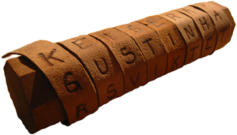
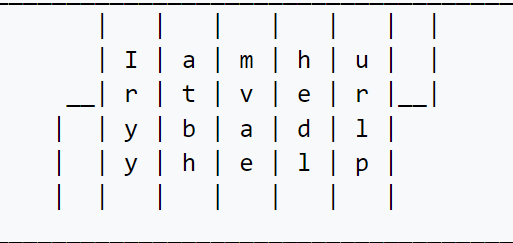

# Scytale

Encryption algorithm used to perform a [transposition cipher](https://en.wikipedia.org/wiki/Transposition_cipher).

### Encryption tools

- The material to write the message on (should be as a strip).
- a cylinder with a _specific radius_ (fixed for the receiver and transmitter).



# Encryption

1. Wrap the cylinder with the strip..
2. Write the message on the strip (row by row).
3. Unwrap the strip from the cylinder.
4. Now the strip contains the encrypted message

const SHIFT = 5; // Number of Columns

columns = 5 = (20 / 5) + 1;

# Example

`Iamhurt very badly help` ⇒ `Iryyatbhmvaehedlurlp`



A 2D view of the strip wrapped around the cylinder:

### Notes

- The shift for letters depends on the cylinder radius (it’s like a private key)

---

---

---

### Decryption Required Tools

- The strip contains the encrypted message by the receiver.
- a cylinder has the same _radius_ as the receiver cylinder.

# Decryption

1. Wrap the strip on the cylinder.
2. Read or record the message (in row)


```
_____________________________________________________________
       |   |   |   |   |   |  |
       | I | a | m | h | u |  |
     __| r | t | v | e | r |__|
    |  | y | b | a | d | l |
    |  | y | h | e | l | p |
    |  |   |   |   |   |   |
_____________________________________________________________
```

# A Programmatically View ([online example](https://replit.com/@abdallahnour/Skytale-Alogrithm#index.ts))

1. Split message string into letters
2. Remove spaces
3. Build encrypted message
   1. Take letter
   2. Then the next letter position will be last char position + `shift`
4. Repeat the _3rd_ point, `n` times, where `n` equal number of columns (which equal `shift` value)

```jsx
/**
 * Encrypt Message Using Scytale Algorithm
 * @param {string} msg - Plain Text Message To Encrypt
 * @param {number} shift - Amount Of Shift
 * @returns {string} - Encrypted Message Using Scytale
 */
function encrypt(msg, shift) {
  const msgAsArray = msg.split("").filter((i) => i !== " ");
  const NUMBER_OF_COLUMNS = shift;
  const encryptedMsgAsArray = [];

  for (let j = 0; j < NUMBER_OF_COLUMNS; j++)
    for (let i = j; i < msgAsArray.length; i += shift)
      encryptedMsgAsArray.push(msgAsArray[i]);

  return encryptedMsgAsArray.join("");
}
```

```jsx
/**
 * Decrypt Message Had Been Encrypted Using Scytale Algorithm
 * @param {string} encryptedMsg - Encrypted Message Using Scytale
 * @param {number} shift - Amount Of Shift
 * @returns {string} - Plaintext Message
 */
function decrypt(encryptedMsg, shift) {
  const decryptedMsgAsArray = [];
  const NUMBER_OF_COLUMNS = shift;
  const encryptedMsgAsArray = encryptedMsg.split("");

  for (let j = 0; j < NUMBER_OF_COLUMNS - 1; j++)
    for (let i = j; i < encryptedMsgAsArray.length; i += shift - 1)
      decryptedMsgAsArray.push(encryptedMsgAsArray[i]);

  return decryptedMsgAsArray.join("");
}
```

# Way To Improve Scytale

- Using a non-fixed radius cylinder radius
  - This exponentially harder to guess the width of the encryption cylinder radius.
  - Which leads to harder guessing the next letter in the plain text message.
  - The concern is with transferring the private key (cylinder radius’s).

## History

Used by [ancient Greeks](https://en.wikipedia.org/wiki/Ancient_Greece), and the [Spartans](https://en.wikipedia.org/wiki/Sparta) in particular, are said to have used this cipher to communicate during [military](https://en.wikipedia.org/wiki/Military) campaigns.

# Resources

- [https://en.wikipedia.org/wiki/Transposition_cipher](https://en.wikipedia.org/wiki/Transposition_cipher#General_principle)
- [https://en.wikipedia.org/wiki/Scytale](https://en.wikipedia.org/wiki/Scytale)
- [Encrypt using Scytale online](https://www.dcode.fr/scytale-cipher)
